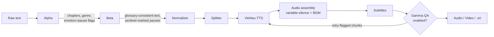
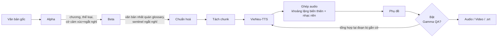

# VoxDirector AI

**Turn raw Vietnamese story text into a narrated audiobook — with consistent character names, genre-appropriate voice casting, dramatic pauses, and optional subtitles/video — using a 3-agent Gemini pipeline on top of on-device VieNeu-TTS.**
**Biến văn bản truyện tiếng Việt thô thành audiobook có lồng tiếng — tên nhân vật nhất quán, chọn giọng đọc hợp thể loại, ngắt nghỉ kịch tính, kèm phụ đề/video tuỳ chọn — bằng pipeline 3 Agent chạy trên Gemini, dựng trên nền VieNeu-TTS chạy tại chỗ.**

[](LICENSE)
[](backend/Dockerfile)
[](frontend/package.json)
[](docker-compose.yml)

> **A note on the badges above / Về các badge phía trên:** no test-coverage
> or download-count badges — no coverage tooling is wired up, and there's
> no downloadable VoxDirector artifact to count (the repo's only GitHub
> Actions workflow publishes the underlying `vieneu` SDK to PyPI, unrelated
> to this application). *Không có badge coverage/lượt tải — chưa gắn công
> cụ đo coverage, và VoxDirector không phải gói được publish để đếm lượt
> tải (workflow GitHub Actions duy nhất của repo là publish gói SDK
> `vieneu` lên PyPI, không liên quan ứng dụng này).* What's shown is real:
> license, pinned runtime versions, deploy method.

<p align="center">
  
</p>

<p align="center"><em>A real run, screenshotted 2026-09-15 — not a mockup. 44-word input, ~55s processing, ~$0.003 in Gemini tokens.<br>Một lần chạy thật, chụp màn hình ngày 2026-09-15 — không phải dàn dựng. Input 44 từ, xử lý ~55s, tốn ~$0.003 token Gemini.</em></p>

<p align="center"><strong><a href="#english">🇬🇧 English</a> · <a href="#tiếng-việt">🇻🇳 Tiếng Việt</a></strong></p>

---

## English

### What is this?

You have a text file — a chapter, a short story, a whole novel — and you
want it narrated out loud in Vietnamese, sounding like it was actually
*directed*, not just read by a robot. VoxDirector AI is a small pipeline of
three Gemini-powered agents plus [VieNeu-TTS](docs/README_SDK.md) that does
that:

1. **Alpha** reads the raw text once: splits it into chapters, detects the
   genre, suggests a matching voice, flags emotionally-charged lines and
   dramatic-pause points.
2. **Beta** rewrites the text in one pass: enforces consistent
   spelling/naming for every character/place/term it's seen before (RAG
   against a persistent glossary), inserts an expression word at Alpha's
   flagged emotional beats, and marks the dramatic-pause points for the
   audio layer to act on.
3. **Gamma** (optional) transcribes its own output back with
   `faster-whisper` and automatically retries any chunk whose Word Error
   Rate or audio health (clipping, dead silence) looks wrong.

Text → chapters → corrected/annotated text → synthesized speech → assembled
audio with variable-length pauses → subtitles → optional video with your
own background image/music. All through one page, watched live over a
WebSocket.

### Why use it, instead of just calling a TTS API directly?

- **It stays consistent across a whole novel.** A character's name gets
  spelled the same way in chapter 40 as in chapter 1 — Beta checks every
  chunk against a ChromaDB-backed glossary instead of trusting the model's
  memory across a long job.
- **It picks a voice and a pace that fit the story**, not a generic
  default — genre detection drives voice suggestion and narration pacing.
- **It's a production pipeline, not a demo.** Background music mixing,
  burned-in subtitles, background-image-driven video export, per-segment
  re-render, and per-job Gemini cost tracking are all real, wired features
  — not roadmap items.
- **It catches its own mistakes.** Gamma's QA pass re-transcribes the
  output and retries chunks that sound clipped, silent, or misheard —
  before you ever hit play.
- **It runs on a CPU.** VieNeu-TTS's standard mode is ONNX-based — no GPU
  required for the core pipeline (Gamma's QA model is the only
  meaningfully RAM-hungry piece, and even that's configurable down to a
  smaller Whisper size on a cheap VPS) — though a GPU is supported and
  faster if you have one (see [Running with a GPU](#running-with-a-gpu-optional) below).
- **Bring your own Gemini key.** Each user can paste their own free-tier
  key (stored in their browser only) instead of sharing one server quota.
- **No invented data.** Where a claim can't be backed by evidence — an
  emotion tag VieNeu-TTS doesn't actually honor, a KPI with no real eval
  set yet — this project says so instead of quietly making something up.
  See [`data/emotion_lexicon.json`](data/emotion_lexicon.json)'s own notes
  for a concrete example.

**Tech stack:** FastAPI (Python 3.12) · Next.js 16 / React / TypeScript ·
Google Gemini (`google-genai`) · [VieNeu-TTS](docs/README_SDK.md) ·
ChromaDB + sentence-transformers (glossary RAG) · faster-whisper (QA) ·
ffmpeg · Docker Compose + nginx.

### Getting Started

#### Prerequisites

- **Docker Desktop** (Windows/Mac) or **Docker Engine + Compose plugin**
  (Linux) — nothing else to install by hand, no local Python/Node needed.
- A free **Gemini API key** from
  [aistudio.google.com/apikey](https://aistudio.google.com/apikey) — "Create
  a new key" and use whatever it gives you (older guidance here said it had
  to start `AIzaSy...`; that turned out to be wrong — test any key you get
  with `curl "https://generativelanguage.googleapis.com/v1beta/models?key=YOUR_KEY"`
  rather than trusting its prefix).

#### Installation

```bash
git clone https://github.com/NTQD/VieNeu-Audio.git
cd VieNeu-Audio
git checkout VoxDirector
cp .env.example .env
```

#### Environment configuration

Open `.env` and set one line (leave everything else as-is — the rest
belongs to the `vieneu` SDK this repo also hosts, unrelated to VoxDirector):

```env
GEMINI_API_KEY=your-key-here
```

#### Run it

```bash
docker compose up --build
```

First run installs several GB of ML dependencies (one-time; later runs
reuse cached layers). Once you see `Application startup complete`, open
**http://localhost** — that one URL serves the whole app.

#### Running with a GPU (optional)

VoxDirector runs fine on CPU by default. If you have an NVIDIA GPU and want
faster voice synthesis:

```bash
docker compose -f docker-compose.yml -f docker-compose.gpu.yml up --build -d
```

This builds the backend against `backend/Dockerfile.gpu` (CUDA-enabled)
instead of the CPU image and grants the container GPU access. Confirm it's
actually being used:

```bash
docker compose logs backend | grep "Thiết bị"
```

— look for `CUDA` instead of `CPU` in that line. Agent Gamma's QA
transcription (`faster-whisper`) stays pinned to CPU by default even in GPU
mode (it's a one-off per-job check, not worth contending with TTS
synthesis for VRAM); override `VOXDIRECTOR_WHISPER_DEVICE=cuda` per-run if
you want full-GPU mode and have the VRAM budget for it.

Requirements: Docker Desktop with WSL2 GPU passthrough enabled (Windows) or
the NVIDIA Container Toolkit (Linux) — verify with
`docker run --rm --gpus all nvidia/cuda:12.8.0-base-ubuntu24.04 nvidia-smi`.
Full walkthrough (written against a specific 8GB-VRAM laptop GPU, useful as
a troubleshooting reference):
[`docs/voxdirector/RUNNING_GPU.md`](docs/voxdirector/RUNNING_GPU.md).

### Usage

1. Paste or drag-and-drop a `.txt`/`.docx` chapter into the left column.
2. Click **"Bắt đầu xử lý"**. Watch genre detection, then live progress
   (Alpha → Beta → voice synthesis → assembly → optional QA) in the right
   column.
3. Play the result, review the transcript, re-render any suspect segment,
   export audio/subtitles (and video, if you supplied a background image).

Full walkthrough with every on-screen label:
[`docs/voxdirector/USER_MANUAL.md`](docs/voxdirector/USER_MANUAL.md).
Calling the API directly instead of the UI:

```bash
curl -X POST http://localhost/api/submit \
  -H "Content-Type: application/json" \
  -d '{"text": "Lý Phong dừng bước trước cổng Hắc Vân Môn...", "alpha_enabled": true}'
```

returns `{"job_id", "chapters", "detected_genre", "suggested_voice_id", ...}`
— then connect to `ws://localhost/api/ws/{job_id}` for live progress, or
poll `GET /api/audio/{job_id}` once it's done.

### Architecture



This repo hosts two things: the `vieneu` TTS SDK (`src/`, `apps/`,
`examples/`, ...) and VoxDirector AI built on top of it. For the full
directory map — what's VoxDirector's, what's the SDK's, and why —
see [`VOXDIRECTOR.md`](VOXDIRECTOR.md). Deploying to a real VPS:
[`docs/voxdirector/DEPLOYMENT_PLAN.md`](docs/voxdirector/DEPLOYMENT_PLAN.md)
(Vietnamese).

### Contributing & License

There's no formal `CONTRIBUTING.md` or PR template yet — open an issue or
PR on [github.com/NTQD/VieNeu-Audio](https://github.com/NTQD/VieNeu-Audio)
(branch `VoxDirector`) and it'll get a real look.

Licensed under [Apache 2.0](LICENSE) — same license as the underlying
`vieneu` SDK.

### Acknowledgments

VoxDirector AI is built entirely on top of
[**VieNeu-TTS**](docs/README_SDK.md) for on-device Vietnamese
speech synthesis, [**Google Gemini**](https://ai.google.dev/) for the three
agents, [**ChromaDB**](https://www.trychroma.com/) +
[**sentence-transformers**](https://www.sbert.net/) for glossary retrieval,
and [**faster-whisper**](https://github.com/SYSTRAN/faster-whisper) for QA
transcription. None of this exists without that SDK's own 10,000+ hours of
training work — see [`docs/README_SDK.md`](docs/README_SDK.md) for the
project it's built on.

<p align="right"><a href="#voxdirector-ai">↑ back to top / lên đầu trang</a></p>

---

## Tiếng Việt

### Dự án này là gì?

Bạn có 1 file văn bản — 1 chương, 1 truyện ngắn, hay cả 1 cuốn tiểu thuyết —
và muốn nó được đọc thành tiếng bằng tiếng Việt, nghe như được *đạo diễn*
thật sự chứ không phải máy đọc vô hồn. VoxDirector AI là 1 pipeline nhỏ gồm
3 Agent chạy trên Gemini cộng với [VieNeu-TTS](docs/README_SDK.md) làm đúng
việc đó:

1. **Alpha** đọc văn bản gốc 1 lần: tách chương, nhận diện thể loại, đề
   xuất giọng đọc phù hợp, gắn cờ các đoạn có cảm xúc rõ rệt và các điểm
   cần ngắt nghỉ kịch tính.
2. **Beta** viết lại văn bản trong 1 lượt xử lý: đảm bảo chính tả/tên gọi
   nhất quán cho mọi nhân vật/địa danh/thuật ngữ đã từng xuất hiện (tra cứu
   RAG trên 1 glossary lưu trữ lâu dài), chèn từ biểu cảm tại các đoạn Alpha
   đã gắn cờ cảm xúc, và đánh dấu các điểm ngắt kịch tính để tầng xử lý âm
   thanh áp dụng.
3. **Gamma** (tuỳ chọn) tự phiên âm lại chính kết quả của mình bằng
   `faster-whisper` và tự động tổng hợp lại bất kỳ đoạn nào có Word Error
   Rate cao hoặc sức khoẻ âm thanh (clipping, khoảng lặng bất thường) đáng
   ngờ.

Văn bản → tách chương → văn bản đã sửa/gắn chú thích → giọng đọc tổng hợp →
ghép âm thanh với khoảng lặng biến thiên → phụ đề → video tuỳ chọn với ảnh
nền/nhạc nền của bạn. Tất cả trên 1 trang, theo dõi trực tiếp qua WebSocket.

### Tại sao dùng cái này thay vì gọi thẳng 1 API TTS?

- **Nhất quán xuyên suốt cả cuốn truyện.** Tên nhân vật được viết giống hệt
  nhau ở chương 40 như ở chương 1 — Beta kiểm tra từng đoạn với 1 glossary
  lưu trên ChromaDB thay vì tin vào trí nhớ của model qua 1 job dài.
- **Chọn giọng đọc và tiết tấu hợp với câu chuyện**, không phải mặc định
  chung chung — nhận diện thể loại quyết định giọng đọc đề xuất và tiết tấu
  kể chuyện.
- **Là 1 pipeline sản xuất thật, không phải bản demo.** Trộn nhạc nền, ghi
  cứng phụ đề vào video, xuất video từ ảnh nền, render lại từng đoạn, và
  theo dõi chi phí Gemini theo từng job — đều là tính năng THẬT đã nối dây
  xong, không phải mục trên roadmap.
- **Tự bắt lỗi của chính mình.** Bước QA của Gamma phiên âm lại kết quả và
  tự tổng hợp lại các đoạn nghe bị cắt, im lặng bất thường, hoặc nghe sai —
  trước khi bạn kịp bấm play.
- **Chạy được trên CPU.** Chế độ Standard của VieNeu-TTS dùng ONNX — không
  cần GPU cho pipeline chính (model QA của Gamma là phần tốn RAM đáng kể
  duy nhất, và cũng có thể cấu hình xuống 1 bản Whisper nhỏ hơn cho VPS
  giá rẻ) — dù vẫn hỗ trợ GPU và chạy nhanh hơn nếu máy có (xem [Chạy với
  GPU](#chạy-với-gpu-tuỳ-chọn) bên dưới).
- **Dùng key Gemini của riêng bạn.** Mỗi người dùng có thể tự dán key
  free-tier của họ (chỉ lưu trên trình duyệt) thay vì dùng chung 1 quota
  của server.
- **Không bịa dữ liệu.** Chỗ nào không có bằng chứng thật để khẳng định —
  1 tag cảm xúc mà VieNeu-TTS thực ra không hỗ trợ, 1 chỉ số KPI chưa có bộ
  eval thật — dự án này nói thẳng ra thay vì âm thầm bịa số liệu. Xem chú
  thích trong chính [`data/emotion_lexicon.json`](data/emotion_lexicon.json)
  để thấy 1 ví dụ cụ thể.

**Công nghệ sử dụng:** FastAPI (Python 3.12) · Next.js 16 / React /
TypeScript · Google Gemini (`google-genai`) ·
[VieNeu-TTS](docs/README_SDK.md) · ChromaDB + sentence-transformers (RAG
glossary) · faster-whisper (QA) · ffmpeg · Docker Compose + nginx.

### Bắt đầu

#### Yêu cầu trước khi cài

- **Docker Desktop** (Windows/Mac) hoặc **Docker Engine + Compose plugin**
  (Linux) — không cần cài gì khác bằng tay, không cần Python/Node cài sẵn
  trên máy.
- 1 **Gemini API key** miễn phí từ
  [aistudio.google.com/apikey](https://aistudio.google.com/apikey) — bấm
  "Create a new key" và dùng bất kỳ key nào nó trả về (hướng dẫn cũ ở đây
  từng nói key phải bắt đầu bằng `AIzaSy...` — điều đó SAI; hãy tự kiểm tra
  key bằng
  `curl "https://generativelanguage.googleapis.com/v1beta/models?key=YOUR_KEY"`
  thay vì tin vào tiền tố của nó).

#### Cài đặt

```bash
git clone https://github.com/NTQD/VieNeu-Audio.git
cd VieNeu-Audio
git checkout VoxDirector
cp .env.example .env
```

#### Cấu hình biến môi trường

Mở `.env` và chỉ cần sửa đúng 1 dòng (giữ nguyên mọi thứ khác — phần còn lại
thuộc về SDK `vieneu` mà repo này cũng đang lưu trữ, không liên quan
VoxDirector):

```env
GEMINI_API_KEY=key-that-cua-ban
```

#### Chạy ứng dụng

```bash
docker compose up --build
```

Lần chạy đầu cài vài GB thư viện ML (chỉ 1 lần; các lần sau dùng lại layer
đã cache). Khi thấy dòng `Application startup complete`, mở
**http://localhost** — chỉ 1 địa chỉ này phục vụ toàn bộ ứng dụng.

#### Chạy với GPU (tuỳ chọn)

Mặc định VoxDirector chạy tốt trên CPU. Nếu máy có GPU NVIDIA và muốn tổng
hợp giọng đọc nhanh hơn:

```bash
docker compose -f docker-compose.yml -f docker-compose.gpu.yml up --build -d
```

Lệnh này build backend từ `backend/Dockerfile.gpu` (có CUDA) thay vì bản
CPU, đồng thời cấp quyền truy cập GPU cho container. Kiểm tra GPU có thực
sự được dùng không:

```bash
docker compose logs backend | grep "Thiết bị"
```

— tìm dòng có chữ `CUDA` thay vì `CPU`. Bước kiểm tra chất lượng của Agent
Gamma (`faster-whisper`) mặc định vẫn chạy trên CPU ngay cả ở chế độ GPU
(đây chỉ là bước kiểm tra 1 lần/job, không đáng để tranh VRAM với việc tổng
hợp giọng đọc); ghi đè `VOXDIRECTOR_WHISPER_DEVICE=cuda` cho từng lần chạy
nếu muốn thử chế độ full-GPU và máy đủ VRAM.

Yêu cầu: Docker Desktop đã bật GPU passthrough qua WSL2 (Windows) hoặc
NVIDIA Container Toolkit (Linux) — kiểm tra bằng
`docker run --rm --gpus all nvidia/cuda:12.8.0-base-ubuntu24.04 nvidia-smi`.
Hướng dẫn đầy đủ (viết trên 1 GPU laptop 8GB VRAM cụ thể, hữu ích để tham
khảo khi gặp lỗi):
[`docs/voxdirector/RUNNING_GPU.md`](docs/voxdirector/RUNNING_GPU.md).

### Sử dụng

1. Dán hoặc kéo-thả 1 file `.txt`/`.docx` vào cột bên trái.
2. Bấm **"Bắt đầu xử lý"**. Theo dõi nhận diện thể loại, rồi tiến trình
   trực tiếp (Alpha → Beta → tổng hợp giọng đọc → ghép → QA tuỳ chọn) ở cột
   bên phải.
3. Nghe thử kết quả, xem lại bản chép lời, render lại đoạn nào nghi ngờ,
   xuất audio/phụ đề (và video, nếu bạn có cung cấp ảnh nền).

Hướng dẫn đầy đủ với từng nhãn trên màn hình:
[`docs/voxdirector/USER_MANUAL.md`](docs/voxdirector/USER_MANUAL.md).
Gọi thẳng API thay vì dùng giao diện:

```bash
curl -X POST http://localhost/api/submit \
  -H "Content-Type: application/json" \
  -d '{"text": "Lý Phong dừng bước trước cổng Hắc Vân Môn...", "alpha_enabled": true}'
```

trả về `{"job_id", "chapters", "detected_genre", "suggested_voice_id", ...}`
— sau đó kết nối `ws://localhost/api/ws/{job_id}` để xem tiến trình trực
tiếp, hoặc gọi lặp lại `GET /api/audio/{job_id}` khi đã xong.

### Kiến trúc



Repo này lưu trữ 2 thứ: SDK TTS `vieneu` (`src/`, `apps/`, `examples/`,
...) và VoxDirector AI xây trên nền đó. Xem toàn bộ sơ đồ thư mục — cái gì
của VoxDirector, cái gì của SDK, và tại sao — tại
[`VOXDIRECTOR.md`](VOXDIRECTOR.md). Triển khai lên VPS thật:
[`docs/voxdirector/DEPLOYMENT_PLAN.md`](docs/voxdirector/DEPLOYMENT_PLAN.md).

### Đóng góp & Giấy phép

Chưa có `CONTRIBUTING.md` hay template PR chính thức — cứ mở issue hoặc PR
trên [github.com/NTQD/VieNeu-Audio](https://github.com/NTQD/VieNeu-Audio)
(branch `VoxDirector`), sẽ được xem xét nghiêm túc.

Cấp phép theo [Apache 2.0](LICENSE) — cùng giấy phép với SDK `vieneu` nền
tảng.

### Lời cảm ơn

VoxDirector AI được xây dựng hoàn toàn trên nền
[**VieNeu-TTS**](docs/README_SDK.md) cho phần tổng hợp giọng nói tiếng Việt
chạy tại chỗ, [**Google Gemini**](https://ai.google.dev/) cho 3 Agent,
[**ChromaDB**](https://www.trychroma.com/) +
[**sentence-transformers**](https://www.sbert.net/) cho tra cứu glossary,
và [**faster-whisper**](https://github.com/SYSTRAN/faster-whisper) cho
phiên âm QA. Không có gì trong số này tồn tại được nếu thiếu công sức
10.000+ giờ huấn luyện của chính SDK đó — xem
[`docs/README_SDK.md`](docs/README_SDK.md) để biết dự án nền tảng.

<p align="right"><a href="#voxdirector-ai">↑ back to top / lên đầu trang</a></p>
