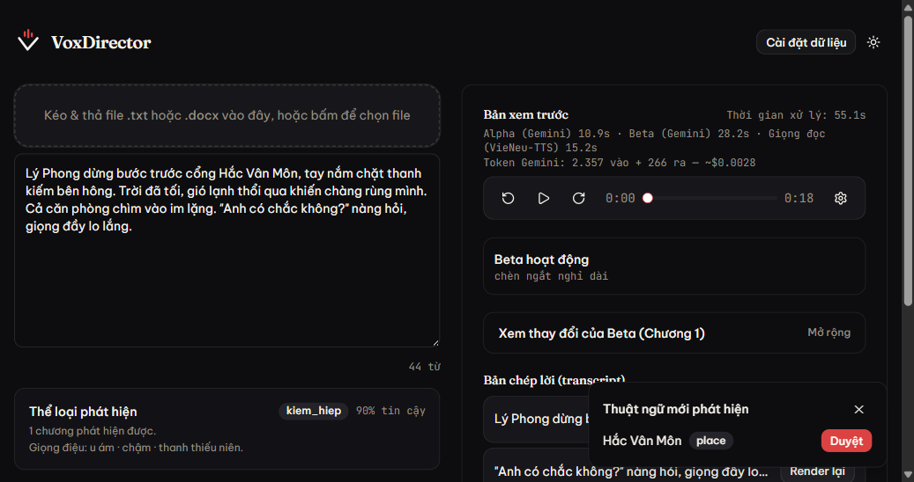
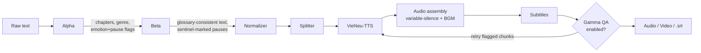

# VoxDirector AI

**Turn raw Vietnamese story text into a narrated audiobook — with consistent character names, genre-appropriate voice casting, dramatic pauses, and optional subtitles/video — using a 3-agent Gemini pipeline on top of on-device VieNeu-TTS.**

[](LICENSE)
[](backend/Dockerfile)
[](frontend/package.json)
[](docker-compose.yml)

> **A note on the badges above:** you won't find test-coverage or
> download-count badges here — no coverage tooling is wired up, and there's
> no published/downloadable VoxDirector artifact to count downloads of
> (the repo's only GitHub Actions workflow publishes the underlying `vieneu`
> SDK to PyPI, unrelated to this application). Manufacturing a badge that
> points at nothing would be worse than no badge. What's shown is real: the
> license, the pinned runtime versions, and the deployment method.

<p align="center">
  
</p>

<p align="center"><em>A real run, screenshotted 2026-09-15 — not a mockup. 44-word input, ~55s processing, ~$0.003 in Gemini tokens.</em></p>

---

## What is this?

You have a text file — a chapter, a short story, a whole novel — and you
want it narrated out loud in Vietnamese, sounding like it was actually
*directed*, not just read by a robot. VoxDirector AI is a small pipeline of
three Gemini-powered agents plus [VieNeu-TTS](docs/README_SDK.md) that does
that:

1. **Alpha** reads the raw text once: splits it into chapters, detects the
   genre, suggests a matching voice, flags emotionally-charged lines and
   dramatic-pause points.
2. **Beta** rewrites the text in one pass: enforces consistent
   spelling/naming for every character/place/term it's seen before (RAG
   against a persistent glossary), inserts an expression word at Alpha's
   flagged emotional beats, and marks the dramatic-pause points for the
   audio layer to act on.
3. **Gamma** (optional) transcribes its own output back with
   `faster-whisper` and automatically retries any chunk whose Word Error
   Rate or audio health (clipping, dead silence) looks wrong.

Text → chapters → corrected/annotated text → synthesized speech → assembled
audio with variable-length pauses → subtitles → optional video with your
own background image/music. All through one page, watched live over a
WebSocket.

## Why use it, instead of just calling a TTS API directly?

- **It stays consistent across a whole novel.** A character's name gets
  spelled the same way in chapter 40 as in chapter 1 — Beta checks every
  chunk against a ChromaDB-backed glossary instead of trusting the model's
  memory across a long job.
- **It picks a voice and a pace that fit the story**, not a generic
  default — genre detection drives voice suggestion and narration pacing.
- **It's a production pipeline, not a demo.** Background music mixing,
  burned-in subtitles, background-image-driven video export, per-segment
  re-render, and per-job Gemini cost tracking are all real, wired features
  — not roadmap items.
- **It catches its own mistakes.** Gamma's QA pass re-transcribes the
  output and retries chunks that sound clipped, silent, or misheard —
  before you ever hit play.
- **It runs on a CPU.** VieNeu-TTS's standard mode is ONNX-based — no GPU
  required for the core pipeline (Gamma's QA model is the only
  meaningfully RAM-hungry piece, and even that's configurable down to a
  smaller Whisper size on a cheap VPS).
- **Bring your own Gemini key.** Each user can paste their own free-tier
  key (stored in their browser only) instead of sharing one server quota.
- **No invented data.** Where a claim can't be backed by evidence — an
  emotion tag VieNeu-TTS doesn't actually honor, a KPI with no real eval
  set yet — this project says so instead of quietly making something up.
  See [`data/emotion_lexicon.json`](data/emotion_lexicon.json)'s own notes
  for a concrete example.

**Tech stack:** FastAPI (Python 3.12) · Next.js 15 / React / TypeScript ·
Google Gemini (`google-genai`) · [VieNeu-TTS](docs/README_SDK.md) ·
ChromaDB + sentence-transformers (glossary RAG) · faster-whisper (QA) ·
ffmpeg · Docker Compose + nginx.

## Getting Started

### Prerequisites

- **Docker Desktop** (Windows/Mac) or **Docker Engine + Compose plugin**
  (Linux) — nothing else to install by hand, no local Python/Node needed.
- A free **Gemini API key** from
  [aistudio.google.com/apikey](https://aistudio.google.com/apikey) — "Create
  a new key" and use whatever it gives you (older guidance here said it had
  to start `AIzaSy...`; that turned out to be wrong — test any key you get
  with `curl "https://generativelanguage.googleapis.com/v1beta/models?key=YOUR_KEY"`
  rather than trusting its prefix).

### Installation

```bash
git clone https://github.com/NTQD/VieNeu-Audio.git
cd VieNeu-Audio
git checkout VoxDirector
cp .env.example .env
```

### Environment configuration

Open `.env` and set one line (leave everything else as-is — the rest
belongs to the `vieneu` SDK this repo also hosts, unrelated to VoxDirector):

```env
GEMINI_API_KEY=your-key-here
```

### Run it

```bash
docker compose up --build
```

First run installs several GB of ML dependencies (one-time; later runs
reuse cached layers). Once you see `Application startup complete`, open
**http://localhost** — that one URL serves the whole app.

## Usage

1. Paste or drag-and-drop a `.txt`/`.docx` chapter into the left column.
2. Click **"Bắt đầu xử lý"**. Watch genre detection, then live progress
   (Alpha → Beta → voice synthesis → assembly → optional QA) in the right
   column.
3. Play the result, review the transcript, re-render any suspect segment,
   export audio/subtitles (and video, if you supplied a background image).

Full walkthrough with every on-screen label:
[`docs/voxdirector/USER_MANUAL.md`](docs/voxdirector/USER_MANUAL.md).
Calling the API directly instead of the UI:

```bash
curl -X POST http://localhost/api/submit \
  -H "Content-Type: application/json" \
  -d '{"text": "Lý Phong dừng bước trước cổng Hắc Vân Môn...", "alpha_enabled": true}'
```

returns `{"job_id", "chapters", "detected_genre", "suggested_voice_id", ...}`
— then connect to `ws://localhost/api/ws/{job_id}` for live progress, or
poll `GET /api/audio/{job_id}` once it's done.

## Architecture



This repo hosts two things: the `vieneu` TTS SDK (`src/`, `apps/`,
`examples/`, ...) and VoxDirector AI built on top of it. For the full
directory map — what's VoxDirector's, what's the SDK's, and why —
see [`VOXDIRECTOR.md`](VOXDIRECTOR.md). Deploying to a real VPS:
[`docs/voxdirector/DEPLOYMENT_PLAN.md`](docs/voxdirector/DEPLOYMENT_PLAN.md)
(Vietnamese).

## Contributing & License

There's no formal `CONTRIBUTING.md` or PR template yet — open an issue or
PR on [github.com/NTQD/VieNeu-Audio](https://github.com/NTQD/VieNeu-Audio)
(branch `VoxDirector`) and it'll get a real look.

Licensed under [Apache 2.0](LICENSE) — same license as the underlying
`vieneu` SDK.

## Acknowledgments

VoxDirector AI is built entirely on top of
[**VieNeu-TTS**](docs/README_SDK.md) for on-device Vietnamese
speech synthesis, [**Google Gemini**](https://ai.google.dev/) for the three
agents, [**ChromaDB**](https://www.trychroma.com/) +
[**sentence-transformers**](https://www.sbert.net/) for glossary retrieval,
and [**faster-whisper**](https://github.com/SYSTRAN/faster-whisper) for QA
transcription. None of this exists without that SDK's own 10,000+ hours of
training work — see [`docs/README_SDK.md`](docs/README_SDK.md) for the
project it's built on.
